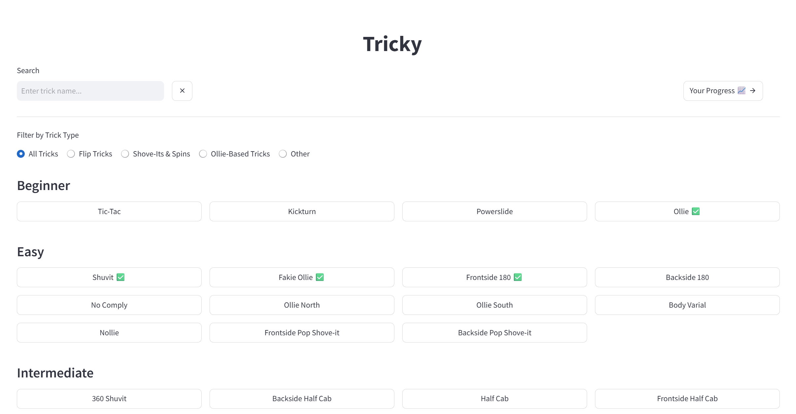
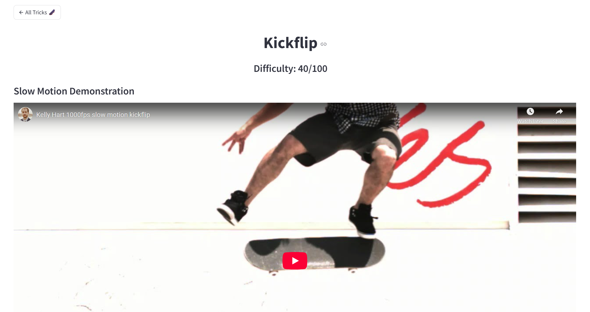
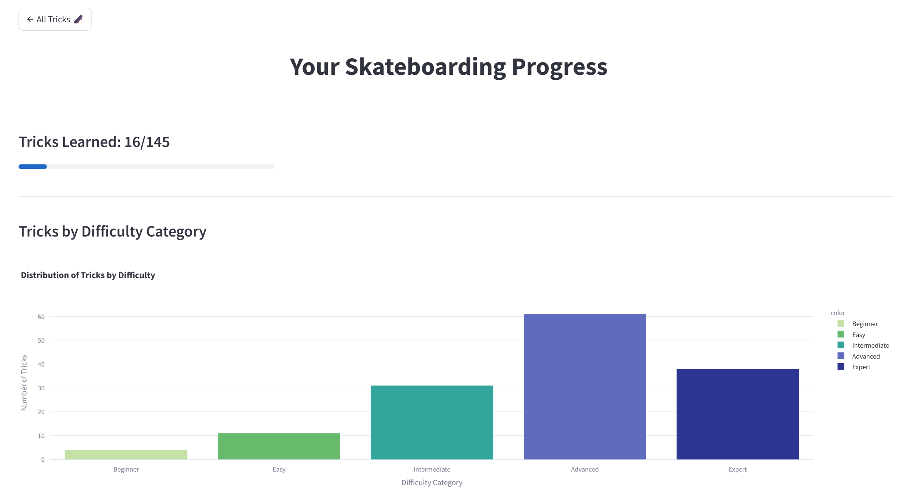

# Tricky - A Skateboarding Trick Learning App
### Live Demo
https://tricky.streamlit.app/

Note: For demonstration purposes, the "Ollie" and "Kickflip" trick pages have been fully updated with proper video content. Every other trick page contains placeholder messages.

## Screenshots

### Homepage

### Trick Page

### Progress Page


## Table of Contents  
- [About The Project](#about-the-project)  
- [Features](#features)  
- [Tech Stack](#tech-stack)  
- [Installation](#installation)  
- [Usage](#usage)
- [Contributing](#contributing)  
- [License](#license)  
- [Contact](#contact)  

## About The Project
Tricky is an interactive web app for learning how to do skateboarding tricks and tracking your progress. I developed this project to deepen my understanding of full-stack development, practice applying HCI principles, and showcase my ability to build a complete, data-driven web solution. Tricky contains 145 tricks categorized by difficulty level and an intuitive UI that allows users to easily search for and filter tricks. It was designed to provide a comprehensive learning experience that involves curated video content with precise timestamp controls, similar trick suggestions, and personal progress tracking. It also features a data analytics dashboard for visualizing user progression metrics, category completion rates, and intelligent trick recommendations for skill advancement.

## Features

* Browse tricks by difficulty category (Beginner, Easy, Intermediate, Advanced, Expert)
* Filter tricks by type (Flip Tricks, Shove-Its & Spins, Ollie-Based Tricks, Other)
* Search for specific tricks
* View instructional videos for each trick (Slow Motion Demonstration, Pro Skater Examples, Tutorial Video)
* Precise start and end times for each video
* Video replay functionality (from the start time of the trick)
* Mark tricks as learned to track progression
* Similar trick suggestions for each trick
* Visual feedback of completed tricks on home page
* Data analytics dashboard for visualizing progression and viewing tailored trick recommendations
* Seamless page navigation with clear buttons

## Tech Stack
* Frontend:

  * Streamlit – A powerful open-source Python library used to create interactive web applications for data science and machine learning.
  * CSS – Used for custom styling and ensuring a polished user interface.
* Data Storage:

  * CSV Files (.csv) – For structured data storage, specifically to store all of the tricks and their difficulty ratings.
  * JSON Files (.json) – Used for flexible data storage, managing user progress (completed tricks) and storing detailed video metadata (including URLs, start/end times, and video categories).
* Data Analysis & Visualization:
  * Pandas – A robust Python library for data manipulation and analysis, crucial for processing trick data and user progression.
  * Plotly – A versatile Python graphing library used to create the interactive and insightful data analytics dashboard.
* Programming Language:

  * Python – The primary programming language powering the application's logic and data processing.
* Version Control:

  * Git – For managing project versions and facilitating development.
  * GitHub – Hosting the project repository and enabling collaboration.

## Installation

To run Tricky locally, follow these steps. It is highly recommended to use a virtual environment to manage dependencies.

### Prerequisites

Ensure you have the following installed on your system:

* **Python 3.11+**
* **Git** (for cloning the repository)

### Step-by-Step Instructions

1.  **Clone the Repository:**
    First, get a copy of the project files onto your local machine.
    ```bash
    git clone https://github.com/mauro210/Tricky
    ```

2.  **Navigate to the Project Directory:**
    Change your current directory to the newly cloned project folder.
    ```bash
    cd Tricky
    ```

3.  **Create a Virtual Environment:**
    A virtual environment isolates your project's Python dependencies from your system's global Python packages, preventing conflicts.
    ```bash
    python -m venv venv
    ```

4.  **Activate the Virtual Environment:**
    You'll need to activate the virtual environment in each new terminal session before running the app.

    * **On macOS and Linux:**
        ```bash
        source venv/bin/activate
        ```
    * **On Windows (Git Bash):**
        ```bash
        source venv/Scripts/activate
        ```
    * **On Windows (Command Prompt):**
        ```cmd
        venv\Scripts\activate.bat
        ```
    * **On Windows (PowerShell):**
        ```powershell
        . .\venv\Scripts\Activate.ps1
        ```
        *Note: If you encounter an error in PowerShell regarding script execution, you might need to adjust your system's system's execution policy. You can often do this by running `Set-ExecutionPolicy -ExecutionPolicy RemoteSigned -Scope CurrentUser` in an administrator PowerShell session, then trying the activation command again.*

    You should see `(venv)` at the beginning of your terminal prompt, indicating the virtual environment is active.

5.  **Install Dependencies:**
    Install all the required Python libraries listed in `requirements.txt`.
    ```bash
    pip install -r requirements.txt
    ```

6.  **Run the Streamlit Application:**
    Once all dependencies are installed, you can start the Streamlit app.
    ```bash
    streamlit run Home.py
    ```

7.  **Access the Application:**
    After running the command in Step 6, your web browser should automatically open to the Streamlit application (usually at `http://localhost:8501`). If it doesn't, copy the URL from your terminal and paste it into your browser.

## Usage
Once the app is running, you can:
* Browse tricks by difficulty level
* Search for specific tricks by name
* Filter tricks by type (e.g., Flip Tricks, Shove-Its & Spins)
* Click on any trick to visit its detailed trick page
* View custom video segments for each trick (fully available for "Ollie" and "Kickflip")
* Replay trick videos using the replay buttons
* Mark tricks as learned to track your progress
* Click the **"Your Progress"** button on the homepage to access the dashboard with visual insights and personalized trick recommendations

## Contributing
Contributions are welcome! If you find a bug or have a suggestion, feel free to open an issue or submit a pull request.

To contribute:
1. Fork the repository
2. Create your feature branch (`git checkout -b feature/YourFeatureName`)
3. Commit your changes (`git commit -m 'Add YourFeatureName'`)
4. Push to the branch (`git push origin feature/YourFeatureName`)
5. Open a pull request

## License
This project is licensed under the MIT License – see the [LICENSE](./LICENSE) file for details.

## Contact
Mauro Angelini - angelinimauro0@gmail.com - https://www.linkedin.com/in/mauro-angelini/
